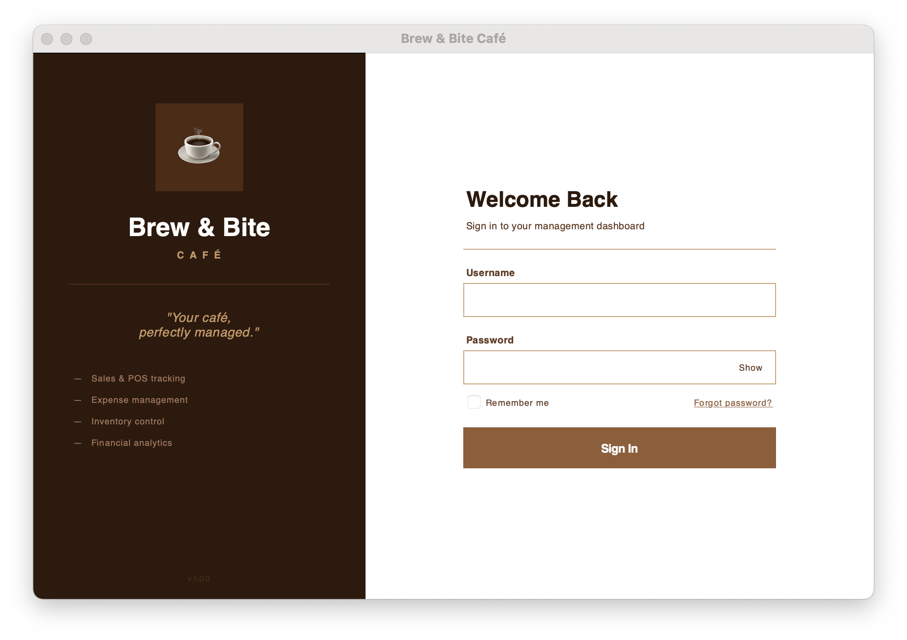
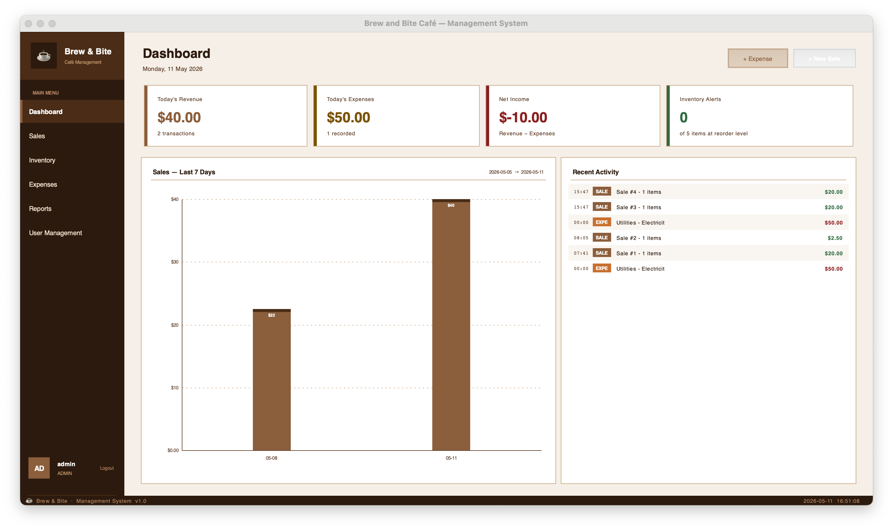
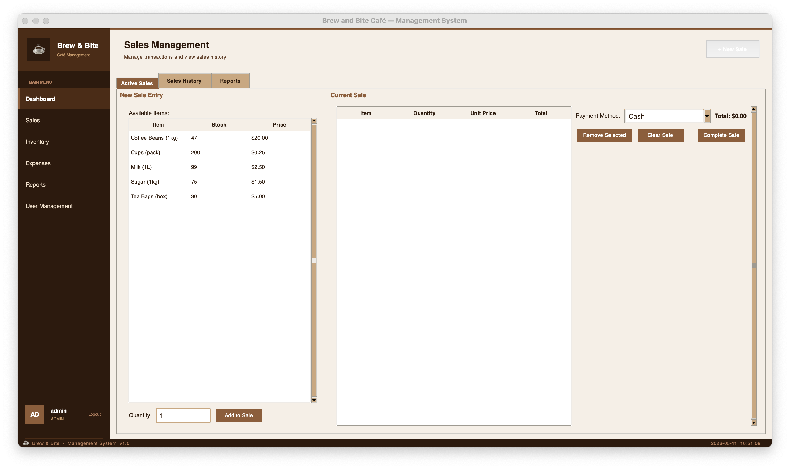
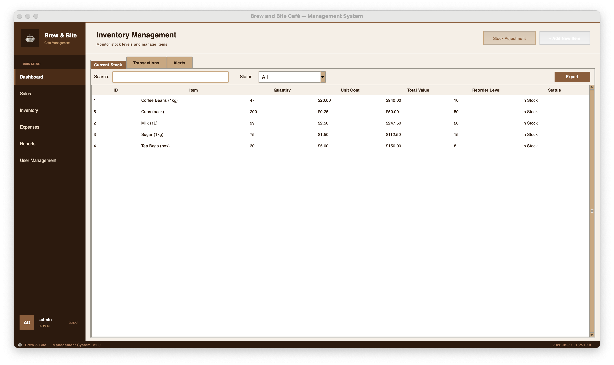
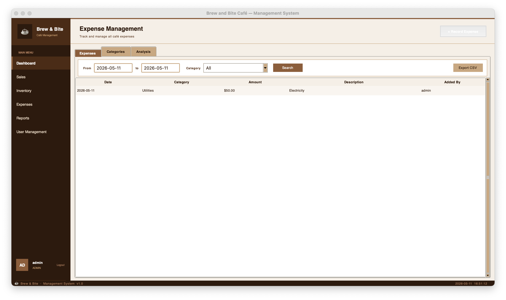
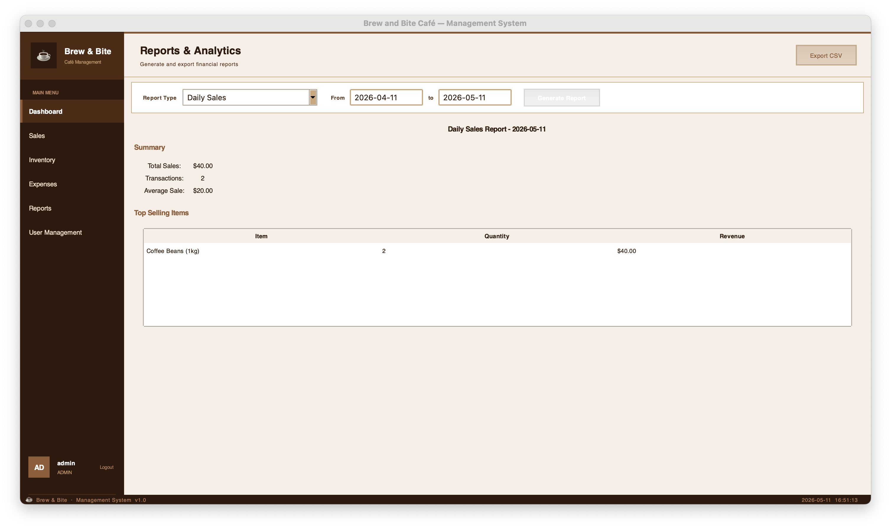

# Brew & Bite Café — Financial Management System

A database-driven desktop application for managing sales, expenses, inventory, and financial reporting — designed for small café businesses.

---

## Screenshots

### Login


### Dashboard


### Sales Management


### Inventory Management


### Expense Management


### Reports & Analytics


---

## Features

### Database Design
- **SQLite** database with a fully normalised schema (3NF).
- Core entities: Users, Expenses, Inventory, Sales, Categories.
- Referential integrity enforced through foreign-key relationships.

### Application Architecture
- **Data Access Layer (DAL)** — SQLAlchemy ORM with parameterised queries to prevent SQL injection.
- **Business Logic Layer (BLL)** — services for user management, expense tracking, inventory control, sales processing, and financial reporting.
- **Presentation Layer (PL)** — Tkinter GUI with a café-themed split-panel design.

### Security
- Password hashing for all user accounts.
- Role-based access control (Admin / Staff).
- Session timeout after 30 minutes of inactivity.

### Reporting
- Daily and monthly sales summaries.
- Product performance analytics.
- Expense category breakdowns.
- CSV export for all reports.

---

## Tools & Libraries

| Tool | Purpose |
|---|---|
| Python 3.12 | Core language |
| SQLite | Embedded database |
| SQLAlchemy | ORM / data access |
| Tkinter | GUI framework |
| pytest | Automated testing |

---

## Getting Started

### 1. Clone the repository
```bash
git clone https://github.com/fredopoku/Brew-and-Bite-Cafe-Financial-Management-System.git
cd Brew-and-Bite-Cafe-Financial-Management-System
```

### 2. Create and activate a virtual environment
```bash
python3 -m venv venv
source venv/bin/activate        # macOS / Linux
venv\Scripts\activate           # Windows
```

### 3. Install dependencies
```bash
pip install -r requirements.txt
```

### 4. Launch the application
```bash
python src/main.py
```

Default admin credentials: **admin / admin123**

---

## Project Structure

```
src/
  bll/          Business logic layer (services)
  dal/          Data access layer (DAOs)
  database/     Models and database initialisation
  gui/          Tkinter screens and styles
  main.py       Application entry point
```

---

*Developed for Brew & Bite Café — © 2024 All rights reserved.*
